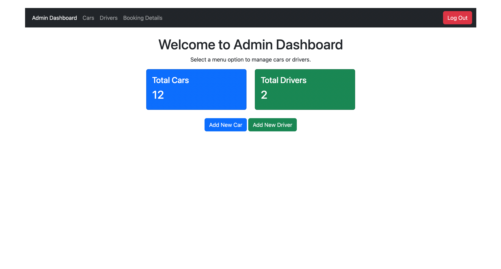
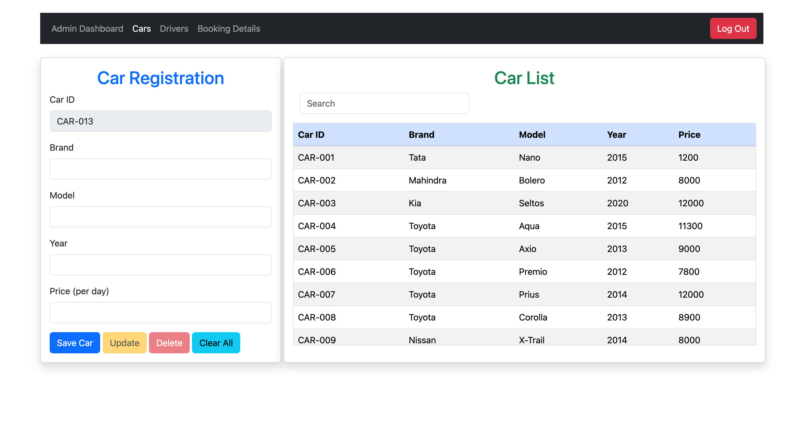
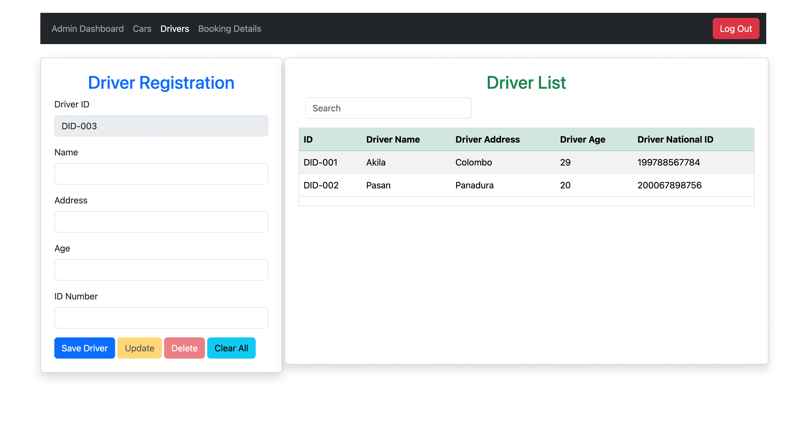
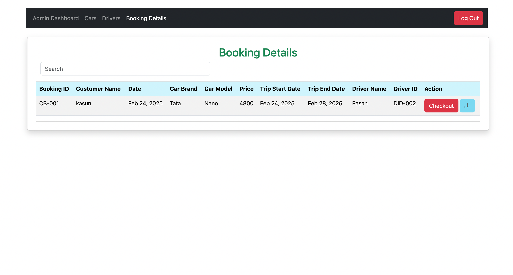
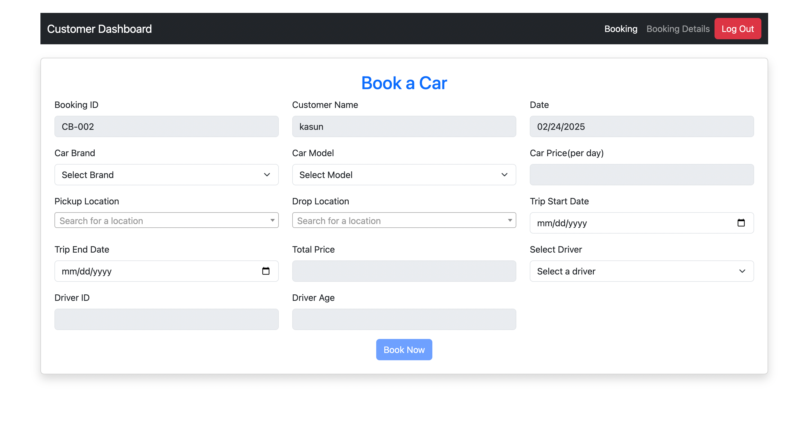
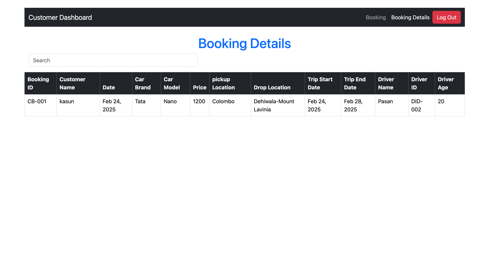

# Car Rental System

---

### Description.

#### Car Rental System is a web application that allows users to book cars for rental. These are the feature of the system:

### Admin

* Admin  can add, delete, and update cars, as well as view all orders.

### Customer

* Customer: Customers can view all available cars, place an order, and view their order details.

### Technology,Tools & Framework

* HTML.
* CSS.
* Java Script
* jQuery.
* Bootstrap.
* IntelliJ IDEA.
* JavaEE
---

# Car Rental System View

Sign In Page

Sign Up Page

Admin Dashboard

Car Register

Driver Register

Admin Booking Details

Customer Dashboard

Customer Booking Details

